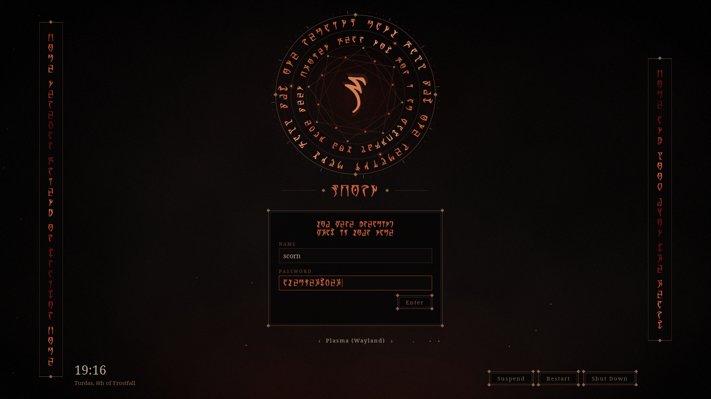
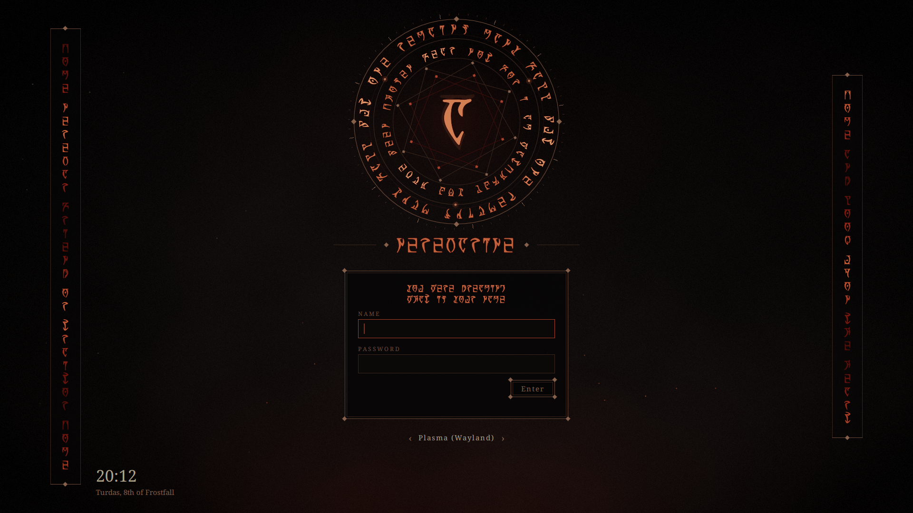

# Daedric Morrowind — SDDM Login

A near-black login screen lit by a faint ember glow. The Daedric script is real: it is set in **OMW Ayembedt** by Georg Duffner
(SIL Open Font License 1.1), which maps the Latin letters A–Z onto the Daedric
alphabet, so every inscription is a readable phrase.

## What is on screen

- **The sigil:** a tick ring, two counter-rotating rings of Daedric script with heat
  travelling around them, embers orbiting the inner circle, two eight-point stars
  turning against each other, ripples, and a breathing rune. The rune is the first
  letter of the username being typed.
- **Banners:** a column of Daedric down each side, shimmering.
- **Username headline:** the name you type, rendered in Daedric as you type it.
- **Greeting:** written in Daedric, one line per sentence.
- **Password:** one rune per character, drawn from a fixed sequence so it reveals
  nothing about what you typed.
- **Readable parts:** field labels, errors, the session picker and the power buttons
  stay in Latin. The date is shown in the Tamrielic calendar.

## What the runes say

| where | inscription |
|---|---|
| outer ring | MANY FALL BUT ONE REMAINS |
| inner ring | FEAR NOT FOR I AM WATCHFUL YOU HAVE BEEN CHOSEN |
| left banner | COME NEREVAR FRIEND OR TRAITOR COME |
| right banner | COME AND LOOK UPON THE HEART |
| greeting | YOU WERE DREAMING / WHAT IS YOUR NAME |

Every inscription can be changed in `theme.conf` (letters A–Z and spaces only: the
font has no digits or punctuation).

## Requirements

SDDM with the **Qt6** greeter (`sddm-greeter-qt6`). Latin text uses Noto Serif; any
serif works (`latinFont=` in `theme.conf`). The Daedric font is bundled.

## Install

    git clone https://github.com/numbpill3d/daedric-morrowind-sddm
    cd daedric-morrowind-sddm
    sudo ./install.sh

Or by hand:

    sudo mkdir -p /usr/share/sddm/themes/daedric-morrowind
    sudo cp -r Main.qml metadata.desktop theme.conf assets fonts preview.png /usr/share/sddm/themes/daedric-morrowind/

then pick **Daedric Morrowind** in System Settings › Colors & Themes › Login Screen (SDDM).

## Preview without logging out

    sddm-greeter-qt6 --test-mode --theme /usr/share/sddm/themes/daedric-morrowind

## The rest of the suite

| piece | repo |
|---|---|
| SDDM login | [daedric-morrowind-sddm](https://github.com/numbpill3d/daedric-morrowind-sddm) |
| Plymouth boot splash | [daedric-morrowind-plymouth](https://github.com/numbpill3d/daedric-morrowind-plymouth) |
| Plasma splash screen | [daedric-morrowind-splash](https://github.com/numbpill3d/daedric-morrowind-splash) |
| Lock screen wallpaper | [daedric-morrowind-lockscreen](https://github.com/numbpill3d/daedric-morrowind-lockscreen) |
| Window decoration | [daedric-morrowind-aurorae](https://github.com/numbpill3d/daedric-morrowind-aurorae) |
| Konsole + kitty colours | [daedric-morrowind-konsole](https://github.com/numbpill3d/daedric-morrowind-konsole) |

## Credits and licence

By splicer scorn (voidrane). GPL-3.0-or-later.
Daedric font: OMW Ayembedt © 2013 Georg A. Duffner, SIL OFL 1.1 (licence text included next to the font).

Unofficial fan work. The Elder Scrolls and Morrowind are trademarks of their
owner; a few short in-world phrases are quoted as inscriptions.
